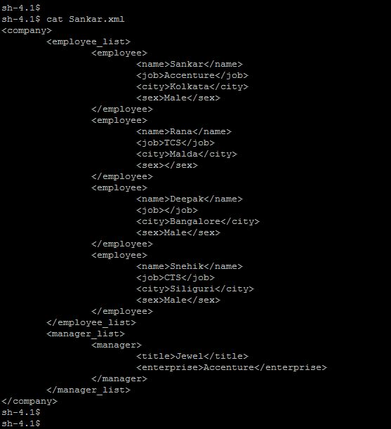
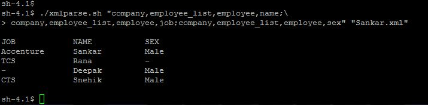

# ShellXMLReader
Bash tool to extracts value from a XML.

***Sample file***

***Sample Execution***

### Limitation and upgrade

Current design of the tool doesnot support non Bash environment.

### Support and managebility

If you are reading this README file then you are probably about to use the this tools to parse XML. Good choice. This tool is made for you. Moreover this tool is free and always will be thats a promise.

Now it is hard to believe that you will get 24/7 Support, thats too much to ask for. But in case you face any issue and want my intervention and you cannot debug the hundreeds lines of core Bash Script your self, please do not hassitate in writting to me. Its a guarentee you will get an answer but it is not a guarentee you will have it in a SLA.

Best of luck. Happy XML Parsing.
